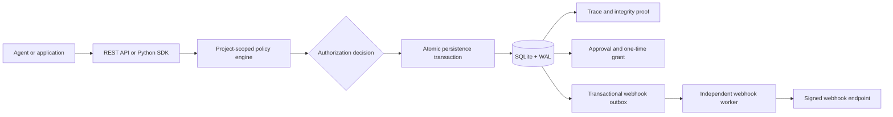

# DecAustrum

Project-scoped authorization, human approval, and verifiable decision evidence
for AI agents and other automated systems.

DecAustrum sits between a caller and a protected side effect. The caller asks
to perform an action, and DecAustrum evaluates the active policy set for that
project. The result is `ALLOW`, `DENY`, or `REQUIRE_APPROVAL`, accompanied by
the policy version, condition evidence, and complete evaluation trace that
produced it.

The interesting part is not evaluating a YAML rule. It is keeping policy,
decision, approval, execution, and audit state consistent when requests are
retried or processes fail. DecAustrum treats that state as part of the
authorization boundary rather than as logging added afterwards.

**Current status:** local, security-focused backend MVP for technical
evaluation. It is not a hosted service and contains no customer or production
data.

## Why this exists

Automated systems can initiate transfers, release data, update records, and
trigger external APIs. A boolean response is not enough when the action later
needs to be explained, approved by a person, retried safely, or investigated.

DecAustrum provides one boundary for those concerns:

| Area | What DecAustrum does |
| --- | --- |
| Authorization | Evaluates project-specific policies with deterministic precedence. |
| Human control | Creates pending approvals and issues short-lived, one-time execution grants after approval. |
| Evidence | Stores the winning policy, version, condition evidence, and full evaluation trace. |
| Integrity | Chains decisions per project and exports evidence bundles that can be verified offline. |
| Delivery | Writes signed webhook events to a transactional outbox for an independent worker. |
| Integration | Exposes a REST API and synchronous/asynchronous Python SDK with typed errors. |

## System at a glance



For a `REQUIRE_APPROVAL` result, the authorization and pending approval are
created in the same transaction. A separate `REVIEWER` API key must resolve
the request; the `RUNTIME` key that submitted it cannot approve it. Approval
can produce a signed execution grant bound to the original project, decision,
agent, action, and context. The grant is consumed before the protected callback
runs and cannot be replayed.

## Authorization example

This request asks a finance agent to initiate a bank transfer:

```http
POST /v1/authorize HTTP/1.1
Host: 127.0.0.1:8000
X-API-Key: replace-with-a-project-api-key
Idempotency-Key: transfer-001
Content-Type: application/json

{
  "agent": "finance-agent",
  "action": "bank_transfer",
  "context": {
    "amount": 25000,
    "account_verified": true
  }
}
```

The response includes identifiers, timestamps, the original request context,
and the complete policy trace. The relevant fields are shown below:

```json
{
  "decision": "REQUIRE_APPROVAL",
  "policy": "large-transfer",
  "policy_version": 1,
  "reason": "Bank transfers above 10000 require approval.",
  "evidence": {
    "match": "all",
    "conditions": [
      {
        "field": "amount",
        "operator": "greater_than",
        "actual_value": 25000,
        "expected_value": 10000,
        "matched": true
      }
    ]
  }
}
```

Repeating the same request with the same idempotency key returns the original
decision. Reusing that key for a different request is rejected as a conflict.
Actions with no active policy are denied and recorded with an empty trace.
For a covered action, every context field referenced by an active policy is
required and must be non-null; an incomplete context is rejected before any
decision or idempotency record is stored.

## Engineering properties

- **Atomic authorization records.** The decision, integrity proof, optional
  approval, idempotency record, and webhook events are committed together.
- **Project isolation.** API keys, active policies, policy history, decisions,
  approvals, grants, audit records, and webhooks are scoped to a project.
- **Separated project roles.** `RUNTIME` keys authorize and consume grants;
  `REVIEWER` keys approve or reject. Reviewer identity is derived from the
  authenticated key rather than accepted from request data.
- **Fail-closed policy evaluation.** Actions without an active policy are
  denied, and missing or null policy inputs are rejected before persistence.
  Conditions support `all` and `any` matching; `DENY` takes precedence over
  `REQUIRE_APPROVAL`, which takes precedence over `ALLOW`.
- **Closed approval lifecycle.** Pending requests can be approved, rejected, or
  expired. Approved grants are short-lived, single-use, and request-bound.
- **Immutable administrative history.** Policy versions and administrative
  audit events are append-only. A rollback creates a new policy version instead
  of rewriting history.
- **Tamper-evident evidence.** Canonical decision records form a per-project
  SHA-256 chain. JSON, NDJSON, CSV, and offline ZIP evidence exports are
  available with record and byte bounds; CSV text is neutralized before it can
  be interpreted as a spreadsheet formula.
- **Transactional event delivery.** A separate worker delivers HMAC-signed
  webhooks at least once, with retry and dead-letter handling.
- **Defensive API boundary.** Trusted hosts, optional HTTPS enforcement,
  content and body-size checks, rate limits, safe error responses, structured
  logs, strict finite JSON values, and bounded Prometheus metrics are built in.

## Quick start

The supported runtime is CPython 3.12. Local setup, CI, and the container image
use pinned dependency locks with SHA-256 hashes.

The values in `.env.example` are placeholders for local development. Do not
reuse them in a shared or production environment.

Production servers must leave `DECAUSTRUM_API_KEY` unset. Create the first
project through the authenticated administrative API, which issues a random
project key. SDK clients still use `DECAUSTRUM_API_KEY` for their issued key.
See [production provisioning and upgrade steps](docs/operations.md#production-project-provisioning).

### Windows PowerShell

```powershell
Copy-Item .env.example .env
powershell -ExecutionPolicy Bypass -File .\scripts\bootstrap.ps1
.\.venv\Scripts\python.exe -c "from app.api_keys import generate_project_api_key; print(generate_project_api_key())"
# Put the printed key in DECAUSTRUM_API_KEY in .env before starting the API.
.\scripts\run-api.ps1
```

If several Python installations are present, select the interpreter explicitly:

```powershell
powershell -ExecutionPolicy Bypass -File .\scripts\bootstrap.ps1 `
    -Python "C:\Path\To\Python312\python.exe"
```

### Linux or macOS

```bash
cp .env.example .env
sh ./scripts/bootstrap.sh
.venv/bin/python -c 'from app.api_keys import generate_project_api_key; print(generate_project_api_key())'
# Put the printed key in DECAUSTRUM_API_KEY in .env before starting the API.
sh ./scripts/run-api.sh
```

The API is then available at:

- interactive documentation: <http://127.0.0.1:8000/docs>
- liveness: <http://127.0.0.1:8000/health/live>
- readiness: <http://127.0.0.1:8000/health/ready>

Run webhook delivery in a second terminal:

```powershell
.\scripts\run-worker.ps1
```

or:

```bash
sh ./scripts/run-worker.sh
```

### Docker Compose

After copying `.env.example` to `.env`, generate a local project key using
`app.api_keys.generate_project_api_key()` as shown above and put it in
`DECAUSTRUM_API_KEY`. Replace the other secret placeholders too. Then:

```console
docker compose up --build
```

Compose starts the API and webhook worker, stores SQLite state in the named
`decaustrum-data` volume, runs the containers as an unprivileged user, drops
Linux capabilities, and binds the development API only to `127.0.0.1`.

Stop the services without deleting their evidence:

```console
docker compose down
```

Volume deletion is deliberately a separate operation.

## Python SDK

The SDK is packaged independently from the backend and depends only on
`httpx`:

```console
python -m pip install -e ./sdk/python
```

The guard places a business operation behind authorization:

```python
from decaustrum import DecAustrumClient, DecAustrumGuard


def submit_transfer() -> dict[str, str]:
    return {"status": "submitted"}


with DecAustrumClient.from_environment() as client:
    result = DecAustrumGuard(client).execute(
        agent="finance-agent",
        action="bank_transfer",
        context={
            "amount": 300,
            "account_verified": True,
        },
        operation=submit_transfer,
        idempotency_key="transfer-001",
    )
```

For `DENY` and `REQUIRE_APPROVAL`, the SDK raises a typed exception and does
not invoke the callback. The SDK also supports asynchronous callers, approval
polling, and execution-grant consumption. It refuses plaintext HTTP for remote
hosts and never follows redirects while carrying an API key; local loopback
HTTP remains available for development. See the [Python SDK guide](docs/sdk-python.md)
and [runnable integration example](sdk/python/examples/protected_bank_transfer.py).

## Verification

Run the same local quality gate used by CI:

```powershell
.\scripts\check.ps1
```

or:

```bash
sh ./scripts/check.sh
```

The repository has more than 500 automated tests across 47 test files. The
gate enforces an 88.0% combined line-and-branch coverage floor, checks lint
with Ruff and static types with mypy, audits dependency vulnerabilities,
rejects new Python security findings, scans publishable files for secrets, and
builds the SDK wheel in a temporary directory.

GitHub Actions repeats the checks on Ubuntu, validates the POSIX automation,
and adds CodeQL, dependency review, repository and container scanning, plus a
container readiness smoke test. Tool
versions, Python dependencies, the Python base image, and action revisions are
pinned for reproducibility. Locked Python artifacts are additionally verified
against their recorded SHA-256 hashes during installation and audit.

## Suggested review path

For a focused technical review, these files show the main design decisions:

1. [Policy evaluation](app/policy_engine.py) — condition evidence, complete
   traces, and deterministic decision precedence.
2. [Authorization service](app/services/authorization.py) — project isolation,
   idempotency, approvals, integrity records, and event creation.
3. [Persistence facade](app/evidence_store.py) and
   [database boundary](app/storage/database.py) — transaction ownership,
   migrations, WAL configuration, and database-enforced invariants.
4. [Offline evidence verifier](app/evidence_verifier.py) — canonical records,
   manifest validation, and integrity-chain verification.
5. [SDK guard](sdk/python/src/decaustrum/guard.py) — enforcement immediately
   before a real business callback.
6. [Architecture notes](docs/architecture.md) — boundaries, failure semantics,
   threat model, and deliberate tradeoffs.

## Repository layout

| Path | Purpose |
| --- | --- |
| `app/` | FastAPI boundary, application services, policy engine, persistence, integrity, and worker. |
| `policies/` | Validated seed policy templates used when a project is bootstrapped. |
| `sdk/python/` | Independently installable synchronous and asynchronous Python SDK. |
| `tests/` | Unit, integration, API, migration, security, and invariant tests. |
| `docs/` | Architecture, operational runbooks, and SDK integration guidance. |
| `scripts/` | Reproducible setup, verification, service, worker, and evidence-verification commands. |
| `.github/` | CI, security analysis, dependency review, and automated dependency updates. |

## Scope and tradeoffs

The current implementation deliberately optimizes for a reviewable local MVP:

- SQLite in WAL mode keeps the transaction model easy to inspect and operate
  locally. Multiple API processes would require a server database and a shared
  rate limiter.
- The SHA-256 decision chain detects missing, reordered, or changed records.
  Without an externally trusted checkpoint or signature, it does not provide
  non-repudiation against a privileged operator who can rewrite the database
  and recompute the chain.
- Webhooks use at-least-once delivery. Receivers must handle duplicate event
  identifiers idempotently.
- The local inline webhook dispatcher is an explicit development option; the
  independent worker is the intended execution model.
- No deployment is included. Publishing this repository does not expose an API,
  database, customer environment, or production service.

Production evolution would replace the local persistence and coordination
components without changing the public authorization model.

## Documentation

- [HTTP API](docs/http-api.md): authentication boundaries, request semantics,
  route map, errors, evidence exports, and approval workflow.
- [Architecture](docs/architecture.md): boundaries, transactions, approvals,
  integrity, webhooks, security model, and limitations.
- [Operations](docs/operations.md): configuration, hardening, logs, metrics,
  backups, incident procedures, and evidence verification.
- [Python SDK](docs/sdk-python.md): synchronous and asynchronous clients, typed
  errors, approval flows, and guarded side effects.
- [Security policy](.github/SECURITY.md): private reporting, scope, and safe
  evaluation expectations.

## License, portfolio evaluation, and support

Copyright (c) 2026 Tadeo Adrián Troncoso Taraborrelli. All rights reserved.

DecAustrum is source-available for portfolio evaluation; it is not open-source
software. Recruiters, interviewers, potential investors, partners, and
prospective commercial licensees may inspect, clone, build, and run it in a
local or isolated non-production environment solely to evaluate the project or
its author's professional work.

Production use, commercial exploitation, redistribution, public hosting,
incorporation into another product or service, and third-party AI training are
not permitted without a separate written agreement. GitHub's own public
repository functionality remains governed by GitHub's applicable terms.

No support, maintenance, warranty, security-fix commitment, or service level is
provided. See the complete [license terms](LICENSE), [support policy](SUPPORT.md),
[security policy](.github/SECURITY.md), [third-party notices](THIRD_PARTY_NOTICES.md),
and [contribution policy](CONTRIBUTING.md).

Publishing this source repository does not deploy DecAustrum or expose a hosted
API, customer environment, database, or production service.
